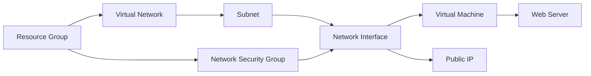

# Azure Web Server Deployment with Terraform


This Terraform project automates the deployment of a complete web server infrastructure on Microsoft Azure, including virtual networking, security groups, and a Linux virtual machine with automated web server installation.

---

## 📚 Table of Contents

- [Features](#features)
- [Architecture](#architecture)
- [Prerequisites](#prerequisites)
- [Quick Start](#quick-start)
- [Configuration](#configuration)
- [Input Variables](#input-variables)
- [Outputs](#outputs)
- [Usage Examples](#usage-examples)
- [Maintenance](#maintenance)
- [Troubleshooting](#troubleshooting)
- [Contributing](#contributing)
- [License](#license)

---

## 🚀 Features

- **Complete Infrastructure Deployment**:
  - Resource Group
  - Virtual Network and Subnet
  - Network Security Group (NSG)
  - Linux Virtual Machine (Ubuntu 22.04 LTS)
  - Public IP Address

- **Automated Configuration**:
  - Cloud-init for automatic web server installation
  - Custom startup commands
  - SSH key authentication

- **Security**:
  - Configurable NSG rules
  - SSH access restriction
  - Web server ports management

---

## 🧭 Architecture



---


✅ Prerequisites
---------------

Before using this Terraform configuration, ensure you have:

*   **Azure Account**: An active Azure subscription with sufficient permissions
    
*   **Terraform**: v1.5.0 or later installed
    
*   **Azure CLI**: Installed and configured with az login
    
*   **SSH Key Pair**: For secure VM access (public key will be used)
    

⚡ Quick Start
-------------

### Clone the repository

` git clone https://github.com/your-repo/azure-webserver.git  cd azure-webserver   `

### Initialize Terraform

`   terraform init   `

### Create a terraform.tfvars file

`   cp terraform.tfvars.example terraform.tfvars   `

### Edit the configuration

Modify terraform.tfvars with your settings (see Configuration)

### Deploy the infrastructure

`   terraform plan  terraform apply   `

⚙️ Configuration
----------------

### Main Configuration File (terraform.tfvars)

```hcl
rg_name = "my-webserver-rg"
loc     = "eastus"

vm_config = {
  name              = "web-vm01"
  size              = "Standard_B1s"
  admin_username    = "adminuser"
  ssh_public_key    = "ssh-rsa AAAAB3Nz..."
  webserver_package = "nginx"
  startup_commands  = [
    "echo 'Welcome to our web server' > /var/www/html/index.html"
  ]
}

network_config = {
  vnet_name     = "web-vnet"
  address_space = "10.0.0.0/16"
  subnet_name   = "web-subnet"
  subnet_prefix = "10.0.1.0/24"
}

nsg_config = {
  name = "web-nsg"
  rules = [
    {
      name                       = "allow-http"
      priority                   = 100
      direction                  = "Inbound"
      access                     = "Allow"
      protocol                   = "Tcp"
      source_port_range          = "*"
      destination_port_range     = "80"
      source_address_prefix      = "*"
      destination_address_prefix = "*"
    },
    {
      name                       = "allow-ssh"
      priority                   = 110
      direction                  = "Inbound"
      access                     = "Allow"
      protocol                   = "Tcp"
      source_port_range          = "*"
      destination_port_range     = "22"
      source_address_prefix      = "203.0.113.1/32" # Your IP address
      destination_address_prefix = "*"
    }
  ]
}
```
---
📥 Input Variables
------------------

### Resource Group

VariableDescriptionTypeDefaultrg\_nameResource group namestring-locAzure regionstring-

### Virtual Machine

VariableDescriptionTypeDefaultvm\_config.nameVM namestring-vm\_config.sizeVM sizestring"Standard\_B1s"vm\_config.admin\_usernameAdmin usernamestring"adminuser"vm\_config.ssh\_public\_keySSH public keystring-vm\_config.webserver\_packageWeb server packagestring"nginx"vm\_config.startup\_commandsStartup commandslist(string)\[\]

### Network

VariableDescriptionTypeDefaultnetwork\_config.vnet\_nameVirtual network namestring-network\_config.address\_spaceVNet address spacestring-network\_config.subnet\_nameSubnet namestring-network\_config.subnet\_prefixSubnet prefixstring-

### Network Security Group

VariableDescriptionTypeDefaultnsg\_config.nameNSG namestring-nsg\_config.rulesSecurity ruleslist(object)-

📤 Outputs
----------

After successful deployment, the following outputs will be available:

`Outputs:  public_ip = "20.127.45.89"  resource_group_name = "my-webserver-rg"  vnet_id = "/subscriptions/.../virtualNetworks/web-vnet"`

### View all outputs

`   terraform output   `

### Get specific output (e.g., public IP)

`terraform output -raw public_ip`

### Scale the VM

Modify the vm\_size in terraform.tfvars:

`vm_config = {    size = "Standard_B2s"    # ... other config  }`

Apply changes:


`terraform apply`

🔧 Maintenance
--------------

### Updating the Configuration

Make changes to terraform.tfvars

`terraform plan  terraform apply`

### Destroying Resources

To tear down all created resources:

`terraform destroy`

🛠️ Troubleshooting
-------------------

### Common Issues

*   **Authorization Errors**:
    
    *   Ensure you're logged in with Azure CLI (az login)
        
    *   Verify your account has sufficient permissions
        
*   **SSH Connection Issues**:
    
    *   Verify the NSG allows your IP address on port 22
        
    *   Check the VM's SSH service is running
        
*   **Web Server Not Accessible**:
    
    *   Check port 80 is open in NSG
        
    *   Verify the web service is running on the VM
        
    *   Review cloud-init logs in /var/log/cloud-init-output.log
        
*   **Terraform Errors**:
    
    *   Run terraform init -upgrade if provider-related
        
    *   Check Azure resource limits if deployment fails