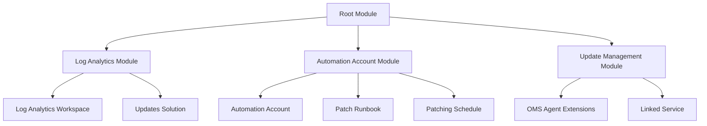

# Azure Update Management with Terraform

This Terraform module automates the deployment of Azure Update Management for patching Azure VMs, including Log Analytics workspace, Automation Account, and update scheduling.

## Features

- 🛠️ Creates Log Analytics workspace for update monitoring
- ⚡ Provisions Automation Account for update management
- 🔄 Configures weekly patching schedule for VMs
- 📊 Onboards VMs to Azure Update Management
- 🔒 Secure handling of workspace keys (marked sensitive)

## Architecture


---
Usage
-----

### Prerequisites

*   Azure subscription
    
*   Terraform 1.0+ installed
    
*   Azure provider configured
    
*   Contributor permissions on target resource group
    

### Deployment Steps

1.  bashgit clone https://github.com/your-repo/azure-update-management.gitcd azure-update-management
    
2.  hclenvironment = "prod"location = "eastus"resource\_group\_name = "rg-patch-management"vm\_names = \["/subscriptions/.../virtualMachines/vm1", ...\]
    
3.  bashterraform initterraform plan -out=tfplanterraform apply tfplan
    

## Input Variables

| Name | Description | Type | Default | Required |
|------|-------------|------|---------|----------|
| `environment` | Deployment environment (dev/staging/prod) | `string` | - | yes |
| `location` | Azure region for resources | `string` | - | yes |
| `resource_group_name` | Existing resource group name | `string` | - | yes |
| `vm_names` | List of VM resource IDs to patch | `list(string)` | `[]` | no |
| `tags` | Resource tags | `map(string)` | `{ Environment = "Production", Owner = "IT Operations", CostCenter = "IT123" }` | no |
| `alert_action_group_id` | Action Group ID for alerts | `string` | `null` | no |

## Outputs

| Name | Description |
|------|-------------|
| `automation_account_name` | Created Automation Account name |
| `log_analytics_workspace_id` | Log Analytics Workspace ID |
| `update_management_status` | Map of VM to OMS Agent extension IDs |
| `patch_schedule_id` | Weekly patch schedule ID |

Module Reference
----------------

### Log Analytics Module

*   Creates workspace with Updates solution
    
*   30-day retention by default
    
*   PerGB2018 SKU
    

### Automation Account Module

*   Basic SKU Automation Account
    
*   Weekly patch schedule
    
*   PowerShell runbook for patching
    

### Update Management Module

*   Links Log Analytics to Automation Account
    
*   Installs OMS agents on target VMs
    
*   Configures update management
    

Patching Schedule
-----------------

Default configuration:

*   Weekly patching (every Sunday 2AM UTC)
    
*   Critical and security updates only
    
*   Automatic reboot if required
    
*   4-hour maintenance window
    

To modify schedule:

```hcl
module "automation_account" {
  # ... other parameters ...
  schedule_start_time = "2023-01-01T22:00:00Z" # 10PM UTC
  timezone           = "Eastern Standard Time"
}
```

---

Best Practices
--------------

1.  **Test First**: Deploy to non-production first
    
2.  **Maintenance Windows**: Align with your business hours
    
3.  **VM Tagging**: Use tags to create dynamic patch groups
    
4.  **Monitoring**: Set up alerts for failed updates
    
5.  **Review Updates**: Check update compliance dashboard weekly
    