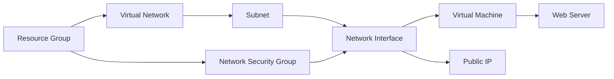
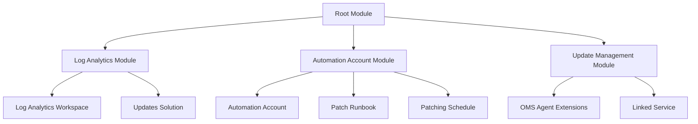

# Azure Web Server Deployment  and update amanagement.


This Terraform project automates the deployment of a complete web server on Microsoft Azure  and deployment of Azure Update Management for patching Azure VMs in automated workflow.

## Features

- **Complete Infrastructure Deployment**:
  - Resource Group
  - Virtual Network and Subnet
  - Network Security Group (NSG)
  - Linux Virtual Machine (Ubuntu 22.04 LTS)
  - Public IP Address

- **Automated Configuration**:
  - Cloud-init for automatic web server installation
  - Custom startup commands
  - SSH key authentication

- **Security**:
  - Configurable NSG rules
  - SSH access restriction
  - Web server ports management

- 🛠️ Creates Log Analytics workspace for update monitoring
- ⚡ Provisions Automation Account for update management
- 🔄 Configures weekly patching schedule for VMs
- 📊 Onboards VMs to Azure Update Management
- 🔒 Secure handling of workspace keys (marked sensitive)

  ## 🧭 Architecture
-  WebServer Deployment:

-  Automated Patching Deployment:



For further information on webserver deployment and Automated patch deployment, refer to below link,

- Webserver Deployment -  https://github.com/deenaramu/test/tree/main/Final/Assignment1
- Automated Patching - https://github.com/deenaramu/test/tree/main/Final/Assignment2

- ** Usage:

    This bonus project helps us to deploy webserver and add the deployed vm to the automated patch with specific schedule.

### Updating the Configuration

Make changes to terraform.tfvars
```hcl
terraform plan 
terraform apply
```

  


