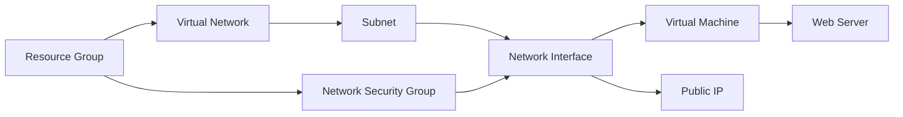

# Azure Web Server Deployment with Terraform

This Terraform project automates the deployment of a complete web server infrastructure on Microsoft Azure, including virtual networking, security groups, and a Linux virtual machine with automated web server installation.

---

## 📚 Table of Contents

- [Features](#features)
- [Architecture](#architecture)
- [Prerequisites](#prerequisites)
- [Quick Start](#quick-start)
- [Configuration](#configuration)
- [Input Variables](#input-variables)
- [Outputs](#outputs)
- [Usage Examples](#usage-examples)
- [Maintenance](#maintenance)
- [Troubleshooting](#troubleshooting)
- [Contributing](#contributing)
- [License](#license)

---

## 🚀 Features

- **Complete Infrastructure Deployment**:
  - Resource Group
  - Virtual Network and Subnet
  - Network Security Group (NSG)
  - Linux Virtual Machine (Ubuntu 22.04 LTS)
  - Public IP Address

- **Automated Configuration**:
  - Cloud-init for automatic web server installation
  - Custom startup commands
  - SSH key authentication

- **Security**:
  - Configurable NSG rules
  - SSH access restriction
  - Web server ports management

---

## 🧭 Architecture

---------------

